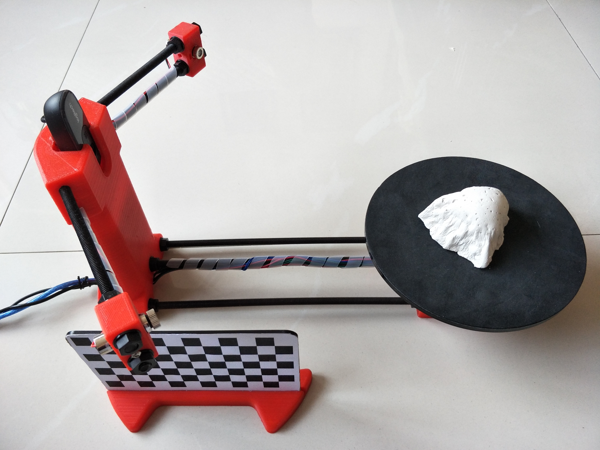
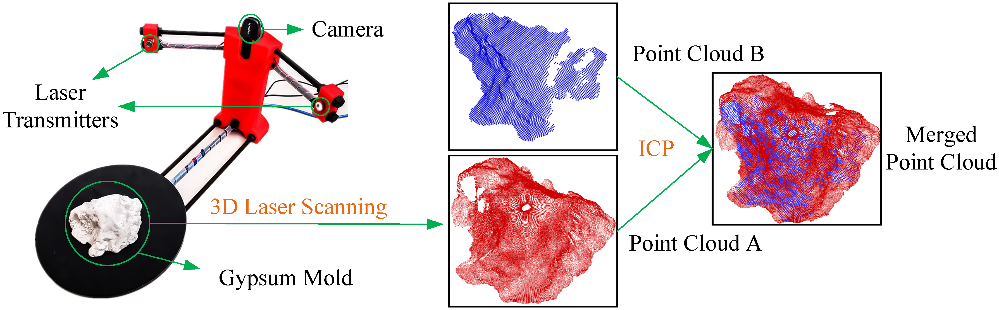
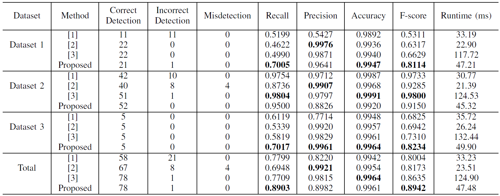

# Rethinking Road Surface 3D Reconstruction and Pothole Detection: From Perspective Transformation to Disparity Map Segmentation

This repository provides the road data used in our publication "[Rethinking Road Surface 3D Reconstruction and Pothole Detection: From Perspective Transformation to Disparity Map Segmentation](https://arxiv.org/pdf/2012.10802.pdf)" [IEEE Transactions on Cybernetics]. 


## 1. Road Pothole 3D Geometry Reconstruction Dataset: 

In our [previous work](https://www.ruirangerfan.com/pdf/tip2018_fan.pdf), the accuracy of the reconstructed 3D road surface was evaluated using three sample models printed with a MakerBot Replicator 2 Desktop 3D Printer. This is an indirect way! Therefore, in this work, we evaluated the reconstructed road potholes’ accuracy straightforwardly.

We first poured enough gypsum plaster into a pothole and dug the gypsum mold out when it became dry and hardened. Then, we used a [BQ Ciclop 3D laser scanner](https://www.amazon.com/Ciclop-Scanner-Kit-Advanced-Laser/dp/B014G8GMEO) (assembled and calibrated by ourselves). We provide **the materials regarding the assembly and calibration of such a BQ Ciclop 3D laser scanner** in the [materials](./materials) folder. An example of our used laser scanner and the obtained gypsum mold is shown below:

<p align="center">

</p>

An example of the 3D road pothole model reconstructed using this laser scanner is shown below:

<p align="center">

</p>

Then, we use the iterative closest point (ICP) algorithm to register the road pothole point clouds A and B (see below), which are acquired using laser scanning and stereo vision technologies, respectively. 

<p align="center">

</p>
To quantify road pothole 3D geometry reconstruction accuracy, we measure the root mean squared closest distance error.
Our experimental results indicate that the road pothole 3D geometry reconstructed using stereo vision technology achieved an accuracy of 2.23 mm. The stereo road image pairs and their ground-truth road pothole 3D geometry models are provided in the [dataset](https://github.com/ruirangerfan/rethinking_road_reconstruction_pothole_detection/tree/main/dataset) folder. 


## 2. Road Pothole Detection Dataset

The road pothole detection dataset can be download from this [repository](https://github.com/ruirangerfan/stereo_pothole_datasets). You can run our demo code to see the visualization of different types of road data. Some examples of the road pothole detection results are given below:

<p align="center">

</p>

where (a) left road images, (b) transformed disparity images (obtained using our previously published [disparity transformation algorithm](https://github.com/ruirangerfan/unsupervised_disparity_map_segmentation)), (c)-(f) pothole detection results achieved using [1], [2], [3] and our method, respectively. The quantitative results are also provided below:

<p align="center">

</p>

## 3. Citations
Please cite the following papers when using our road data:
```
@article{fan2020tcyb,
  title={Rethinking Road Surface 3D Reconstruction and Pothole Detection: 
  From Perspective Transformation to Disparity Map Segmentation},
  author={Fan, Rui and Ozgunalp, Umar and Wang, Yuan and Liu, Ming and Pitas, Ioannis},
  journal={IEEE Transactions on Cybernetics},
  year={2021},
  publisher={IEEE}
}
```
```
@article{fan2019tip,
  title={Pothole detection based on disparity transformation and road surface modeling},
  author={Fan, Rui and Ozgunalp, Umar and Hosking, Brett and Liu, Ming and Pitas, Ioannis},
  journal={IEEE Transactions on Image Processing},
  volume={29},
  pages={897--908},
  year={2019},
  publisher={IEEE}
}
```
```
@article{fan2019road,
  title={Road damage detection based on unsupervised disparity map segmentation},
  author={Fan, Rui and Liu, Ming},
  journal={IEEE Transactions on Intelligent Transportation Systems},
  volume={21},
  number={11},
  pages={4906--4911},
  year={2019},
  publisher={IEEE}
}
```


## References
[1] Zhang, Z., 2013. Advanced stereo vision disparity calculation and obstacle analysis for intelligent vehicles (Doctoral dissertation, University of Bristol).
<br>
[2] Mikhailiuk, A. and Dahnoun, N., 2016, October. Real-time pothole detection on TMS320C6678 DSP. In 2016 IEEE International Conference on Imaging Systems and Techniques (IST) (pp. 123-128). IEEE.
<br>
[3] Fan, R., Ozgunalp, U., Hosking, B., Liu, M. and Pitas, I., 2019. Pothole detection based on disparity transformation and road surface modeling. IEEE Transactions on Image Processing, 29, pp.897-908.


## **Stories behind this work:**

- When working on this project, I was a third-year Ph.D. student at the University of Bristol. 

- When submitting this paper, I was a fresh postdoc at HKUST. 

- When this paper was FINALLY accepted, it had been almost a year since I started my second postdoc at UCSD, and now my postdoc career is nearly coming to an end...

We experienced a very annoying review process. We submitted this work for peer-review on **Apr. 11, 2019**. We got the initial feedback on **Jul. 28, 2019**, and resubmitted our first revision on **Aug. 22, 2019**. However, nothing was back to us until **Jul. 09, 2020** (after DOZENS of emails from us, enquiring about the reviewers' feedback). We submitted the second revision on **Aug. 06, 2020**, and it FINALLY got accepted on **Jan. 01, 2021**. So, the peer-review lasted for around **21 months**. 
